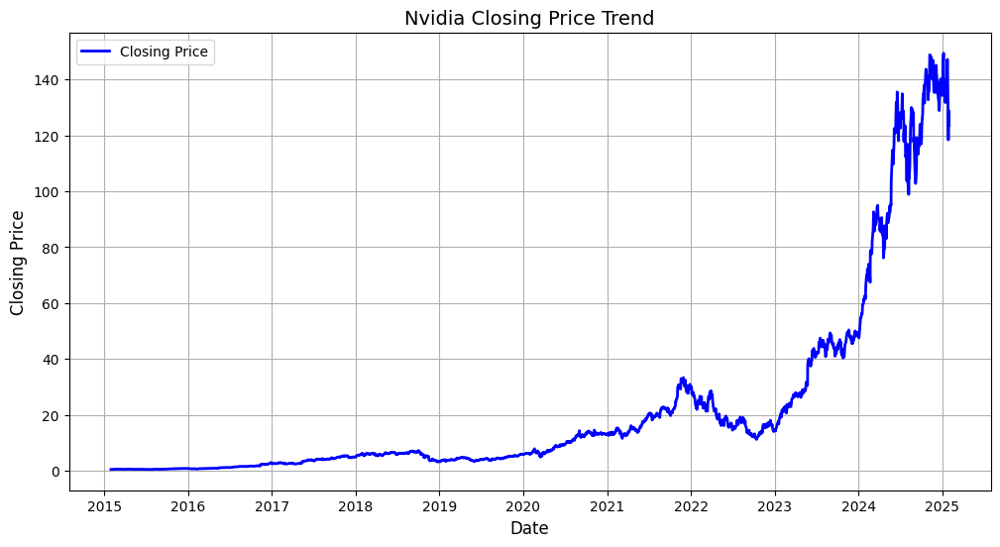
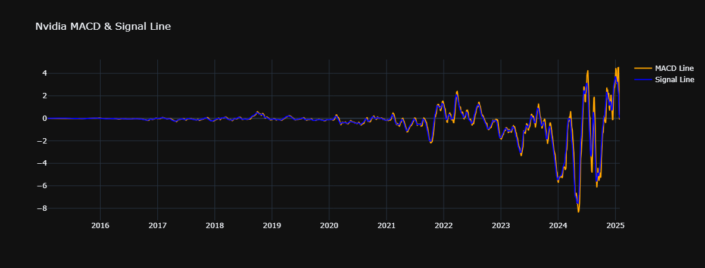
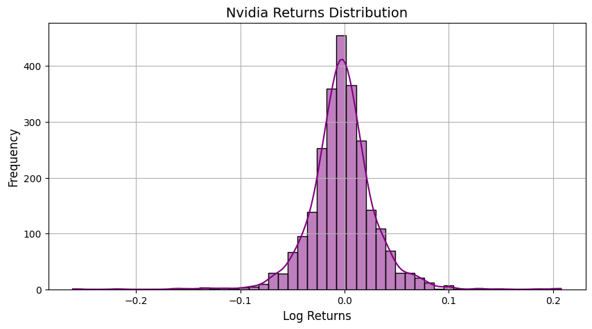
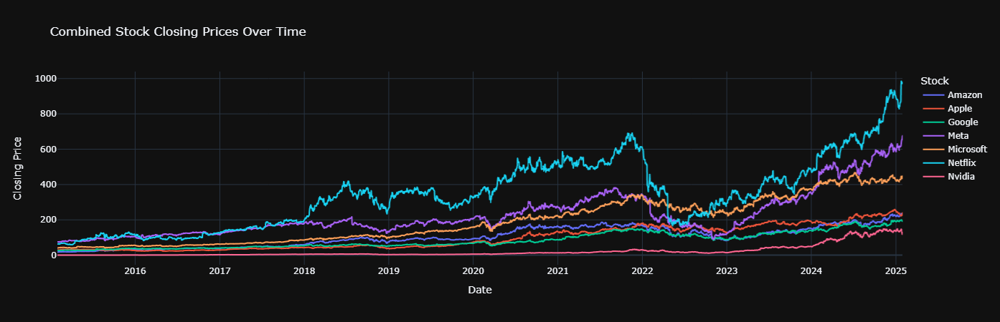
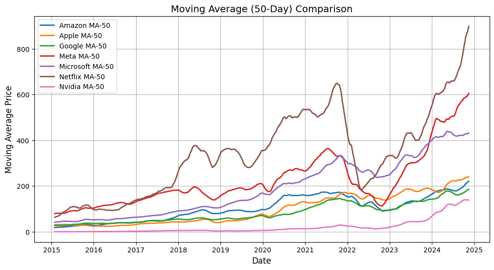

# MNCs Companies Stocks Prediction

  
  
  
  
  
  
  

### 📝 Project Context
The stock market is highly dynamic, and predicting stock prices is a challenging yet crucial task for investors and financial analysts. This project focuses on predicting the stock prices of top MNS (Microsoft, Nvidia, Google, Amazon, Apple, Netflix, Meta) companies using machine learning models. It utilizes historical stock data from 2015 to 2025 to make predictions and provide valuable insights.

To make it accessible, we have built a simple Flask-based web application where users can input a company name and past days, and the system will predict the stock price accordingly. Additionally, we aim to integrate Generative AI to offer stock market insights.

### 🎯 Project Objective
- Build a Flask web app for stock price prediction.
- Perform data preprocessing & feature engineering for enhanced model accuracy.
- Conduct exploratory data analysis (EDA) to extract meaningful insights.
- Develop a machine learning model to predict stock prices.
- Implement interactive and static visualizations for better understanding.
- Explore the role of generative AI in financial insights.

### 📊 Data Preprocessing

#### 1️⃣ Data Cleaning
- Converted Close, High, Low, and Open prices from object to float by removing the $ sign.
- Checked for missing values and handled them appropriately.

#### 2️⃣ Feature Engineering
- Added the following features to improve model performance:
- Log Returns: Captures percentage change in stock prices.
- Exponential Moving Average (EMA 10): Identifies short-term trends.
- Relative Strength Index (RSI 7): Measures stock momentum.
- MACD & Signal Line: Detects bullish/bearish trends.

🔹 Final preprocessed dataset was exported for EDA & modeling.

### 📈 Exploratory Data Analysis (EDA)

#### 1️⃣ Basic Statistical Analysis
- Checked summary statistics (mean, median, standard deviation, etc.).
- Performed Augmented Dickey-Fuller (ADF) Test to check stationarity.

#### 2️⃣ Data Visualizations
📌 For Individual Stocks:
- Time series plots for Close, Volume, High, Low prices.

    

- Trend analysis using moving averages.

    

- Distribution plots for price fluctuations.

    

📌 For Combined Stocks:
- Comparative interactive line plots for all companies.

    

- Static seaborn/matplotlib plots for correlations and distributions.

    

